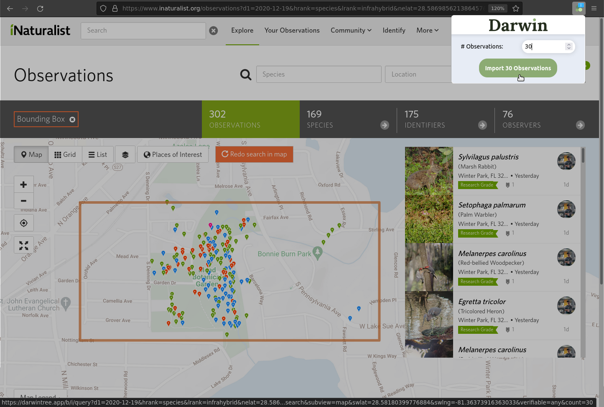

# Darwin Browser Extension

Quickly import [iNaturalist](https://www.inaturalist.org) observations, from search results or profiles, and [eBird](https://ebird.org) checklists into [Darwin](https://darwintree.app)

Supports Firefox and Chrome; build both with `./build.sh`. Uses Manifest v2 for Firefox and v3 for Chrome.

## Install
[Add to Firefox](https://addons.mozilla.org/en-US/firefox/addon/darwin-import/)

